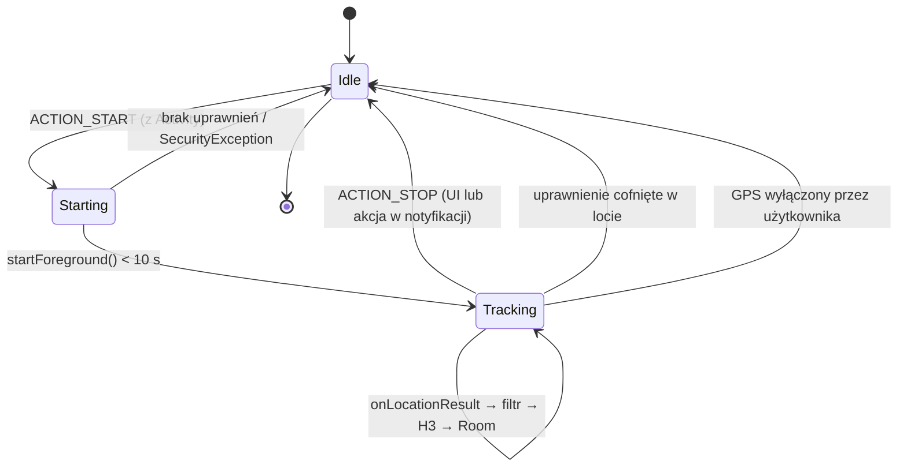

# GPS_SERVICE_SPEC.md

**Projekt:** Tripex Pose
**Faza:** M4 / Faza 4 — Silnik Lokalizacji w Tle
**Status:** Draft do implementacji (wejście dla Fazy 4.1 w Cursorze)
**Target SDK:** 34+ (Android 14), minSdk 26

---

## 1. Cel i zakres

Serwis odpowiada za jedną rzecz: **zamianę ciągłego strumienia pozycji GPS na zbiór odblokowanych indeksów H3 zapisanych w Room**, działając również gdy aplikacja jest zminimalizowana lub ekran jest wygaszony.

**W zakresie:**
- Foreground Service typu `location` z poprawną notyfikacją.
- Pobieranie lokalizacji przez `FusedLocationProviderClient`.
- Filtrowanie śmieciowych fixów (niska dokładność, mock, jitter).
- Konwersja Lat/Lng → `Set<Long>` (H3) przez `H3Utils` i zapis do Room.
- Propagacja stanu serwisu (running/stopped) do UI.

**Poza zakresem MVP:**
- Restart po reboocie urządzenia (wymaga `ACCESS_BACKGROUND_LOCATION`, patrz §9.4).
- Synchronizacja z backendem, eksport tras, zapis polilinii trasy.
- Geofencing i Activity Recognition.

---

## 2. Kluczowe decyzje projektowe

| # | Decyzja | Uzasadnienie |
|---|---------|--------------|
| D1 | Serwis **nie jest bindowany** (`onBind` → `null`) | UI nie potrzebuje bezpośredniej referencji. Jedynym źródłem prawdy dla odkrytego terenu jest Room (`Flow`), a dla stanu serwisu — singleton `TrackingStateHolder`. Eliminuje to problemy z cyklem życia bindowania i wycieki. |
| D2 | Komunikacja przez `Intent` + akcje (`ACTION_START` / `ACTION_STOP`) | Prosty, jednokierunkowy kanał sterowania. |
| D3 | Serwis **nie zna** Room ani H3 bezpośrednio | Serwis wstrzykuje `UnlockAreaUseCase` (Domain). Cała logika geometrii i persistencji jest testowalna bez Androida. |
| D4 | `LocationTracker` jako interfejs w Domain, implementacja w Data | Abstrakcja nad `FusedLocationProviderClient`. Umożliwia (a) testy z `FakeLocationTracker`, (b) ewentualny fallback na czysty `LocationManager` dla urządzeń bez Google Play Services — istotne, bo reszta stosu (MapLibre) jest celowo GMS-free. |
| D5 | `callbackFlow` zamiast callbacków | `LocationCallback` opakowany w `Flow<Location>`; `awaitClose { removeLocationUpdates() }` gwarantuje sprzątanie. |
| D6 | Rozdzielczość H3 — parametr, nie stała w serwisie | Wartość ustalona w `H3_ARCHITECTURE.md` (zakładany res 9–10 dla pieszego). Serwis nie podejmuje decyzji geometrycznych. |

---

## 3. Uprawnienia i konfiguracja manifestu

### 3.1 `AndroidManifest.xml`

```xml
<uses-permission android:name="android.permission.ACCESS_COARSE_LOCATION" />
<uses-permission android:name="android.permission.ACCESS_FINE_LOCATION" />

<uses-permission android:name="android.permission.FOREGROUND_SERVICE" />
<!-- Android 14+ : osobne uprawnienie per typ serwisu -->
<uses-permission android:name="android.permission.FOREGROUND_SERVICE_LOCATION" />

<!-- Android 13+ : bez tego notyfikacja serwisu jest niewidoczna -->
<uses-permission android:name="android.permission.POST_NOTIFICATIONS" />

<application>
    <service
        android:name=".service.TrackingService"
        android:exported="false"
        android:foregroundServiceType="location" />
</application>
```

### 3.2 Model uprawnień — kolejność i pułapki

1. `POST_NOTIFICATIONS` — prosić **przed** startem serwisu (API 33+). Brak zgody nie blokuje serwisu, ale użytkownik nie widzi notyfikacji.
2. `ACCESS_FINE_LOCATION` + `ACCESS_COARSE_LOCATION` — prosić **łącznie w jednym dialogu**. Od Androida 12 użytkownik może przyznać tylko przybliżoną lokalizację; przy `COARSE` (~1–2 km błędu) fog of war jest bezużyteczny → aplikacja musi wykryć ten przypadek i pokazać ekran wyjaśniający z deep-linkiem do ustawień.
3. **`ACCESS_BACKGROUND_LOCATION` NIE jest potrzebne w MVP.** Foreground Service typu `location` uruchomiony, gdy aplikacja jest widoczna, działa na uprawnieniu *while-in-use* bezterminowo — również po zminimalizowaniu i wygaszeniu ekranu. Background location byłoby konieczne dopiero przy starcie trackingu z tła (reboot, geofence, alarm). To świadomie odkładamy, bo wymaga osobnego, dwuetapowego flow zgody (przekierowanie do Ustawień → „Zezwalaj zawsze") i podnosi ryzyko odrzucenia w Google Play.

### 3.3 Twarde ograniczenie Androida 14

Serwis **musi** zostać wystartowany, gdy proces aplikacji jest w stanie widocznym (Activity w foreground). Próba `startForegroundService()` z tła kończy się `ForegroundServiceStartNotAllowedException`. W praktyce: przycisk „Rozpocznij odkrywanie" w UI jest jedynym punktem wejścia.

> **Do weryfikacji przy implementacji:** ograniczenia FGS zmieniały się w każdej kolejnej wersji systemu. Przed kodowaniem sprawdzić aktualną stronę „Foreground service types" i „Behavior changes" dla najnowszego targetSdk (użyj `@Web` w Cursorze).

---

## 4. Cykl życia serwisu



### 4.1 `onCreate()`
- Utworzenie kanału notyfikacji (idempotentne).
- Utworzenie `serviceScope = CoroutineScope(SupervisorJob() + Dispatchers.Default)`.

### 4.2 `onStartCommand(intent, flags, startId)`
Kolejność jest krytyczna:

1. **Natychmiast** `startForeground(NOTIF_ID, notification, FOREGROUND_SERVICE_TYPE_LOCATION)` — system daje ~10 sekund, po których ubija proces z `ANR / ForegroundServiceDidNotStartInTimeException`. Żadnych operacji I/O, DI ani zapytań do bazy przed tym wywołaniem.
2. Rozpoznanie akcji: `ACTION_START` / `ACTION_STOP`.
3. Walidacja uprawnień (`ContextCompat.checkSelfPermission`) — brak → aktualizacja notyfikacji + `stopSelf()`.
4. Subskrypcja `locationTracker.locationUpdates(config)` w `serviceScope`.
5. Ustawienie `TrackingStateHolder.isTracking = true`.
6. Zwrot `START_STICKY`.

**Obsługa `START_STICKY`:** po ubiciu przez system `intent` w `onStartCommand` jest `null`. Traktujemy `null` jako `ACTION_START` — wznawiamy tracking. Guard: jeśli job już aktywny, nie subskrybować drugi raz (`if (locationJob?.isActive == true) return START_STICKY`).

### 4.3 `onDestroy()`
- `serviceScope.cancel()` (kaskadowo → `awaitClose` → `removeLocationUpdates`).
- `TrackingStateHolder.isTracking = false`.
- Flush ewentualnego bufora zapisu do Room (`runBlocking` z krótkim timeoutem albo — bezpieczniej — brak buforowania, patrz §6.3).

### 4.4 `onTaskRemoved()`
Użytkownik zdjął aplikację z listy ostatnich. **Serwis ma dalej działać** (to jest sens fog of war). Nie wywołujemy `stopSelf()`. Warto zalogować zdarzenie — część OEM-ów (Xiaomi, Huawei, Samsung) i tak ubija proces; patrz §9.5.

---

## 5. Konfiguracja `FusedLocationProviderClient`

```kotlin
LocationRequest.Builder(
    Priority.PRIORITY_BALANCED_POWER_ACCURACY,   // ~100 m, głównie sieć/WiFi
    INTERVAL_MS                                   // 15_000
)
    .setMinUpdateIntervalMillis(FASTEST_MS)       // 10_000 — akceptuj szybsze fixy z innych apek
    .setMinUpdateDistanceMeters(MIN_DISTANCE_M)   // 50f
    .setMaxUpdateDelayMillis(BATCH_MS)            // 30_000 — pozwól systemowi batchować
    .setWaitForAccurateLocation(false)
    .build()
```

### 5.1 Parametry (jedno miejsce: `LocationConfig`)

| Stała | Wartość | Uzasadnienie |
|-------|---------|--------------|
| `INTERVAL_MS` | 15 000 | Pieszy przy 5 km/h pokonuje ~21 m / 15 s. Przy H3 res 9 (≈174 m krawędź) to z zapasem wystarcza, by nie przeskoczyć heksa. |
| `MIN_DISTANCE_M` | 50 | Kluczowy dla baterii — stojąc w miejscu nie dostajemy żadnych update'ów. |
| `MAX_ACCURACY_M` | 50 | Fix gorszy niż rozmiar heksa odblokowałby losowy teren. |
| `MAX_SPEED_MPS` | 55 (≈200 km/h) | Opcjonalny „teleport guard" (przyszłość). Odrzucałby skoki BTS, ale też legalne odkrywanie z pociągu/samolotu. **MVP: poza `LocationConfig`** — decyzja produktowa później; gdy wróci, logika należy do `LocationFilter`, nie do serwisu. |

### 5.2 Dlaczego `BALANCED_POWER_ACCURACY`, a nie `HIGH_ACCURACY`

`PRIORITY_HIGH_ACCURACY` trzyma odbiornik GNSS aktywny i potrafi zjeść 15–20% baterii na godzinę. Przy rozdzielczości H3 rzędu 100–200 m dokładność 100 m jest w zupełności wystarczająca. Jeśli testy terenowe pokażą dziury w trasie, podnosimy priorytet **tylko** na czas aktywnego ruchu.

---

## 6. Pipeline danych: GPS → Room

```
FusedLocationProvider
        │  Flow<Location>
        ▼
  LocationFilter          (§6.1 — odrzuca ~20-40% fixów)
        │  Flow<ValidLocation>
        ▼
  UnlockAreaUseCase       (Domain)
        │   ├─ H3Utils.toIndex(lat, lng, res)
        │   ├─ H3Utils.gridDisk(index, ring = 1)
        │   └─ gap filling (§6.2)
        ▼  Set<Long>
  HexRepository.unlock()
        ▼
  Room  @Insert(onConflict = IGNORE)  →  tabela unlocked_hex (PK = hexId)
        │
        ▼  Flow<List<Long>>  (automatyczna emisja)
  ViewModel → MapLibre FillLayer
```

### 6.1 Filtr lokalizacji

Odrzucamy fix, gdy:
- `location.accuracy > MAX_ACCURACY_M`
- `location.isMock` (API 31+; poniżej `isFromMockProvider`) — chyba że `BuildConfig.DEBUG`, bo mockowanie jest nam potrzebne do testów
- fix starszy niż 30 s (porównanie `elapsedRealtimeNanos` z `SystemClock.elapsedRealtimeNanos()`)
- dystans od ostatniego **zaakceptowanego** punktu < 20 m (ochrona przed jitterem przy nieruchomym telefonie, niezależna od `setMinUpdateDistanceMeters`)

### 6.2 Wypełnianie luk (gap filling) — wymóg funkcjonalny

Przy interwale 15 s i jeździe samochodem 50 km/h użytkownik pokonuje ~208 m, czyli **przeskakuje** ponad heks. Efekt: przerywana linia odkrytego terenu zamiast ciągłej ścieżki.

Rozwiązanie: jeśli dystans między poprzednim a obecnym punktem jest w przedziale `(MIN, 2000 m>`, wyznaczamy prostą ścieżkę heksów `H3Utils.gridPathCells(prevIndex, currentIndex)` i odblokowujemy całą. Powyżej 2 km zakładamy przerwę w trackingu (tunel, ubity proces, przelot) i **nie** interpolujemy.

### 6.3 Zapis

- Brak buforowania w pamięci w MVP: każdy zaakceptowany fix → jeden `insertAll(hexes)`. Przy interwale 15 s obciążenie jest pomijalne, a ryzyko utraty danych przy ubiciu procesu zerowe.
- `OnConflictStrategy.IGNORE` + `hexId` jako `PRIMARY KEY` — deduplikacja realizowana przez SQLite, bez zapytań `SELECT` przed zapisem.
- Kolumna `unlockedAt: Long` przydatna później (animacja „świeżo odkryte", statystyki).

---

## 7. Komunikacja Service ↔ UI

Dwa niezależne kanały, oba bez bindowania:

**Kanał A — odkryty teren (dane):**
Room jest jedynym źródłem prawdy. DAO zwraca `Flow<List<Long>>`, ViewModel konsumuje przez `stateIn(viewModelScope, WhileSubscribed(5_000), emptyList())`. Serwis pisze, UI czyta — nie wiedzą o sobie nawzajem. Mapa odświeża się automatycznie.

**Kanał B — stan serwisu (sterowanie):**
```kotlin
@Singleton
class TrackingStateHolder @Inject constructor() {
    private val _state = MutableStateFlow(TrackingState.IDLE)
    val state: StateFlow<TrackingState> = _state.asStateFlow()
    internal fun update(new: TrackingState) { _state.value = new }
}

enum class TrackingState { IDLE, TRACKING, PERMISSION_MISSING, LOCATION_DISABLED }
```
Działa, bo serwis i UI żyją w tym samym procesie. Przy starcie Activity dodatkowo weryfikujemy stan faktyczny przez `ActivityManager.getRunningServices()` lub prostszy, trwały znacznik w DataStore — chroni to przed rozjechaniem stanu po ubiciu i restarcie procesu.

---

## 8. Notyfikacja

| Element | Wartość |
|---------|---------|
| Channel ID | `tracking_channel` |
| Importance | `IMPORTANCE_LOW` (bez dźwięku i wibracji) |
| Tytuł | „Odkrywasz świat" |
| Treść | Dynamiczna: „Odkryto X nowych obszarów" (aktualizacja co N fixów, **nie** co sekundę) |
| Ikona | Monochromatyczna, dedykowana — nie ikona launchera |
| Akcje | `[Zatrzymaj]` → `PendingIntent` z `ACTION_STOP` |
| Tap | `PendingIntent` do `MainActivity` z flagą `FLAG_IMMUTABLE` |
| `setOngoing(true)` | Tak — choć od Androida 14 użytkownik i tak może zsunąć notyfikację FGS; serwis działa dalej, a przy powrocie do apki UI musi pokazać, że tracking trwa |

Aktualizacja treści: `NotificationManager.notify(NOTIF_ID, ...)` z tym samym ID, maksymalnie co ~10 s (throttle), żeby nie obciążać SystemUI.

---

## 9. Przypadki brzegowe i obsługa błędów

### 9.1 Uprawnienie cofnięte w trakcie działania
Android restartuje proces przy cofnięciu uprawnienia lokalizacji. Po restarcie `START_STICKY` wywoła `onStartCommand` z `null` → walidacja z §4.2 pkt 3 wykryje brak zgody → notyfikacja „Tracking zatrzymany — brak uprawnień" + `stopSelf()`. Każde `requestLocationUpdates` opakować w `try/catch (SecurityException)`.

### 9.2 Użytkownik wyłączył GPS
Przed startem serwisu Activity sprawdza `SettingsClient.checkLocationSettings()`. Jeśli wynik to `ResolvableApiException` → `startIntentSenderForResult()` pokazuje systemowy dialog „Włącz lokalizację" bez wychodzenia z aplikacji. Wyłączenie GPS **w trakcie** działania serwisu objawia się po prostu brakiem fixów — po 2 minutach ciszy aktualizujemy notyfikację na „Brak sygnału GPS".

### 9.3 Brak Google Play Services
`GoogleApiAvailability.isGooglePlayServicesAvailable()` przy starcie. Brak GMS → `LocationTracker` powinien mieć drugą implementację opartą na `LocationManager.requestLocationUpdates(GPS_PROVIDER, ...)`. Wybór implementacji w module Hilta (`@Provides` z warunkiem). Nice-to-have, ale interfejs z D4 musi to umożliwiać od pierwszego dnia.

### 9.4 Restart po reboocie
Poza MVP. Wymaga `RECEIVE_BOOT_COMPLETED` + `ACCESS_BACKGROUND_LOCATION` (start FGS typu location z broadcastu). Zamiast tego: przy otwarciu aplikacji sprawdzamy `TrackingState` i pokazujemy banner „Tracking został przerwany — wznów".

### 9.5 Agresywne zabijanie procesów przez OEM
Xiaomi (MIUI), Huawei, OnePlus i Samsung ubijają serwisy mimo poprawnej implementacji. Mitygacja: jednorazowy, dobrze wyjaśniony ekran onboardingu kierujący do ustawień autostartu / wyłączenia optymalizacji baterii (`ACTION_REQUEST_IGNORE_BATTERY_OPTIMIZATIONS`). **Uwaga:** to uprawnienie jest wrażliwe w Google Play — dla apki trackingowej jest uzasadnione, ale wymaga deklaracji w Play Console.

### 9.6 Doze mode
Foreground Service jest zwolniony z Doze, ale częstotliwość fixów przy nieruchomym urządzeniu i tak spada. Jest to zachowanie pożądane — stojąc w miejscu nie odkrywamy niczego nowego.

---

## 10. Struktura plików (wejście dla Cursora)

```
:app
└── service/
    ├── TrackingService.kt          @AndroidEntryPoint, FGS
    ├── TrackingNotification.kt     builder + kanał
    └── TrackingServiceController.kt  start/stop z UI (opakowuje Intenty)

:domain
├── location/
│   ├── LocationTracker.kt         interface → Flow<DomainLocation>
│   ├── DomainLocation.kt          lat, lng, accuracy, timestamp, isMock
│   └── LocationConfig.kt          stałe z §5.1
└── usecase/
    └── UnlockAreaUseCase.kt       DomainLocation → Set<Long> → repo

:data
├── location/
│   ├── FusedLocationTracker.kt    implementacja (callbackFlow)
│   └── LocationFilter.kt          §6.1, czysty Kotlin
└── repository/
    └── HexRepositoryImpl.kt       (istnieje z M3)
```

### Kontrakty

```kotlin
interface LocationTracker {
    /** Emituje pozycje aż do anulowania scope'u. Rzuca SecurityException przy braku uprawnień. */
    fun locationUpdates(config: LocationConfig): Flow<DomainLocation>
}

class UnlockAreaUseCase @Inject constructor(
    private val h3: H3Utils,
    private val repo: HexRepository,
) {
    /** @return liczba NOWO odblokowanych heksagonów (do notyfikacji). */
    suspend operator fun invoke(location: DomainLocation, previous: DomainLocation?): Int
}
```

---

## 11. Plan testów

**Jednostkowe (JVM, bez Androida):**
- `LocationFilter` — tabela przypadków: accuracy 10/49/51/200, mock true/false, fix przeterminowany, jitter < 20 m.
- `UnlockAreaUseCase` z `FakeH3Utils` i `FakeHexRepository` — czy `ring=1` daje 7 heksów, czy gap filling odpala się w zadanym przedziale dystansu, czy duplikaty nie trafiają do repo dwa razy.
- `FusedLocationTracker` — test `callbackFlow` z zamockowanym `FusedLocationProviderClient` (`mockk`), weryfikacja `removeLocationUpdates` po anulowaniu (test na wyciek).

**Instrumentalne:**
- Start/stop serwisu, sprawdzenie widoczności notyfikacji.
- Test na `SecurityException` przy odebranym uprawnieniu.

**Manualne / terenowe (obowiązkowe przed zamknięciem M4):**
- Przejście 1 km pieszo z wygaszonym ekranem → w Room ciągły łańcuch heksów bez dziur.
- Przejazd samochodem 5 km → weryfikacja gap fillingu.
- Test zużycia baterii: 1 h trackingu, odczyt z Battery Historian; **próg akceptacji ≤ 8% na godzinę**.
- Odtworzenie trasy przez mock location w Android Studio (Extended Controls → Routes) — najszybsza pętla feedbacku.

---

## 12. Definition of Done (M4)

- [ ] Serwis startuje z UI, przeżywa minimalizację i wygaszenie ekranu ≥ 30 minut.
- [ ] Notyfikacja poprawna, akcja „Zatrzymaj" działa, tap wraca do aplikacji.
- [ ] Współrzędne trafiają do Room jako indeksy H3, bez duplikatów.
- [ ] Brak wycieku: po `stopSelf()` `removeLocationUpdates` faktycznie wywołane (zweryfikowane testem i Profilerem).
- [ ] Brak uprawnień / wyłączony GPS obsłużone bez crasha.
- [ ] Testy jednostkowe filtra i use case'a zielone.
- [ ] Test terenowy 1 km zaliczony.
- [ ] `TrackingState` poprawnie odzwierciedlony w UI po powrocie do aplikacji.

---

## 13. Prompt dla Fazy 4.1 (Cursor)

> Użyj `@.cursorrules` oraz `@GPS_SERVICE_SPEC.md`. Zaimplementuj `TrackingService` jako Foreground Service typu `location` zgodnie z §4 specyfikacji. Zacznij od interfejsu `LocationTracker` i `FusedLocationTracker` opartego na `callbackFlow` (§10), potem `LocationFilter` (§6.1) z testami jednostkowymi, na końcu sam serwis z notyfikacją (§8). Nie pisz logiki H3 — wywołuj istniejący `UnlockAreaUseCase`. Użyj `@Web`, aby zweryfikować aktualne wymagania `startForeground()` i typów Foreground Service dla najnowszego targetSdk.
